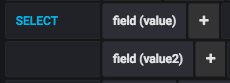

# Grafane

A very opionated influxdb client inspired in grafana's query builder.

## Setup

```
pip install grafane
```

In order to query influxdb this library expects the following environment variables to be set:


+ `INFLUXDB_HOST`: Defaults to **0.0.0.0**
+ `INFLUXDB_PORT`: Defaults to **8086**
+ `INFLUXDB_DB`: Defaults to **metrics**
+ `INFLUXDB_USER`: Defaults to **admin**
+ `INFLUXDB_USER_PASSWORD`: Defaults to **admin123**

## Write

With:

```python
points = [
    {
        'fields': {
            'value': 1.2,
        },
        'tags': {
            'tag1': 'value1',
            'tag2': 'value2'
        }
    },
    {
        'fields': {
            'value': 1.86,
        },
        'tags': {
            'tag1': 'value2',
            'tag2': 'value1'
        }
    },
    {
        'fields': {
            'value': 1.4,
        },
        'tags': {
            'tag1': 'value3',
            'tag2': 'value2'
        }
    },
    {
        'fields': {
            'value': 1.8,
        },
        'tags': {
            'tag1': 'value1',
            'tag2': 'value2'
        }
    },
]
```

You can do either do multiple single queries:

```python
from grafane import Grafane
c = Grafane(metric='generic') # Metric defaults to generic
for p in points:
	c.report(p['fields'], p['tags'])
```

Or a single query with multiple points:

```python
c.report_points(points)
```

if you don't provide `time` for a point it defaults to:

```python
>>> datetime.utcnow().replace(tzinfo=pytz.utc)
datetime.datetime(2019, 2, 8, 19, 32, 38, 788003, tzinfo=<UTC>)
```

## Read

### Select


```python
c.select(fields='value')
results = c.execute_query()
```

```python
>> print(results)
[{'time': '2019-02-08T18:53:05.97273984Z', 'value': 1.2}, {'time': '2019-02-08T18:53:06.022409984Z', 'value': 1.86}, {'time': '2019-02-08T18:53:06.030745088Z', 'value': 1.4}, {'time': '2019-02-08T18:53:06.038643968Z', 'value': 1.8}, {'time': '2019-02-08T18:53:47.19520896Z', 'value': 1.2}, {'time': '2019-02-08T18:53:47.223429888Z', 'value': 1.86}, {'time': '2019-02-08T18:53:47.234020096Z', 'value': 1.4}, {'time': '2019-02-08T18:53:47.243577856Z', 'value': 1.8}, {'time': '2019-02-08T18:54:13.185177088Z', 'value': 1.2}, {'time': '2019-02-08T18:54:13.18522496Z', 'value': 1.86}, {'time': '2019-02-08T18:54:13.185240064Z', 'value': 1.4}, {'time': '2019-02-08T18:54:13.18525184Z', 'value': 1.8}, {'time': '2019-02-08T19:40:36.943924992Z', 'value': 1.2}, {'time': '2019-02-08T19:40:36.947026944Z', 'value': 1.86}]
```

### Select multiple fields



```python
c.select(fields=['value', 'value2'])
```

### Select w/ aggregation


```python
c.select(fields='value', aggregation='sum'))
```

### Select multiple fields w/ aggregation


```python
c.select(fields=['value', 'value2'], aggregation=['sum', 'mean']))
```

# @TODO

- Finish this docs
- Tests for select w/ multiple fields
- Tests for select w/ multiple fields w/ aggregation